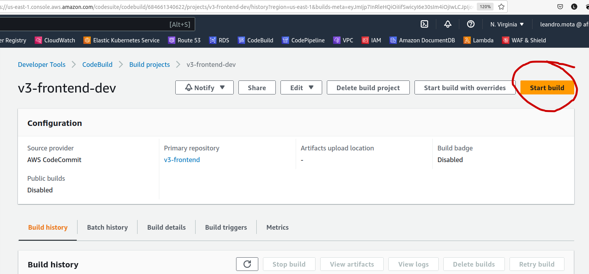
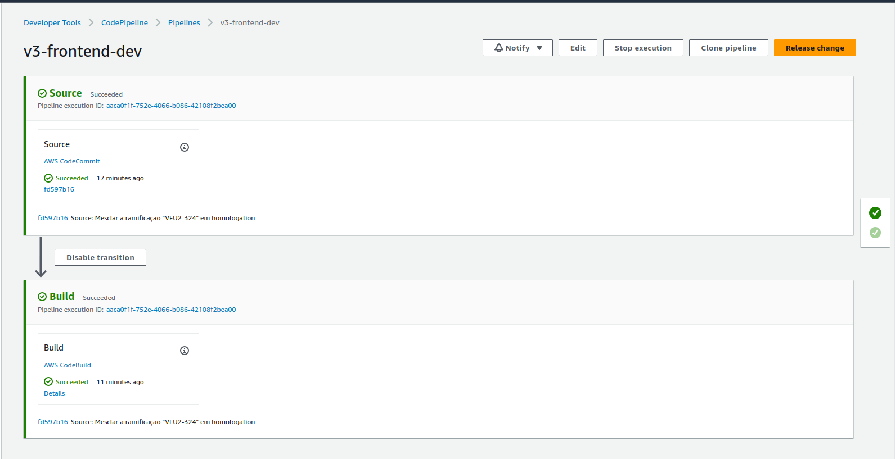

# Instruções para criar e editar recursos para um ambiente novo #

## Prérequisitos:  ##

1. AWS CLI configurado;
2. Conexão com o k8s cluster dev-afilio-v3


## 1. Criar a branch development no code commit ##


Entrar no console do Code Commit:  
https://us-east-1.console.aws.amazon.com/codesuite/codecommit/repositories?region=us-east-1

  - Entrar no repositório do serviço, por exemplo: v3-frontend  
  https://us-east-1.console.aws.amazon.com/codesuite/codecommit/repositories/v3-frontend/browse?region=us-east-1
  - E pegar o ID do commit que servirá de Source (Lembrar ver o ID da branch correta):  
  https://us-east-1.console.aws.amazon.com/codesuite/codecommit/repositories/v3-frontend/commit/fd597b16021877eb16c7825ea1910c1c6c621677?region=us-east-1

E rodar o seguinte comando:
```bash
  aws codecommit create-branch --repository-name MyDemoRepo --branch-name MyNewBranch --commit-id 317f8570EXAMPLE
```
Por exemplo, para v3-frontend:  
```bash
  aws codecommit create-branch --repository-name v3-frontend --branch-name development --commit-id fd597b16021877eb16c7825ea1910c1c6c621677
```

## 2. Criar um novo ECR para o ambiente (Não precisa fazer esse passo para cada serviço, basta a primeira vez) ##

Para criar um repositório novo para armazenar as imagens Docker:  

```bash
aws ecr create-repository \
    --repository-name servicos-dev
```

## 3. Criar um novo Code Build para cada serviço ##

Entrar na console do Code Build:  
https://us-east-1.console.aws.amazon.com/codesuite/codebuild/start?region=us-east-1

1. Clicar em Create project;
2. Seguir as imagens abaixo, com 3932o exemplo para o serviço v3-frontend-dev, modificando para o serviço desejado: 
    - Criar o Project Configuration conforme abaixo:  

    []("Project Config")
    
    - Criar o Source Configuration conforme abaixo:  
    
    []("Source Config")  
    
    - Criar o Environment Configuration conforme abaixo:  
      Anote o nome do ``Service Role`` desse passo que está no campo ``Role Name``, pois utilizaremos ele mais a frente.  
    
    []("Environment Config") 
    
      - Para o Environment Config colocar as seguintes Configurações Adicionais:  
  
      []("Environment Config")
    
    - Criar o Build Spec Configuration usando a opção Insert build commands:  
    
    []("Environment Config")  
    
    Colar o seguinte código abaixo no campo ``Build commands``, mas antes **LEMBRAR DE MODIFICAR OS VALORES DAS SEGUINTES VARIAVEIS**:  
    IMAGE_TAG na linha 15;  
    O nome do Dockerfile para o que estará sendo utilizado no Code Commit, linha 21;  
    Mudar o nome do serviço nas linhas 27 e 28  

    ```yaml
    version: 0.2
    phases:
      install:
        runtime-versions:
          python: 3.8
      pre_build:
        commands:
          - echo Logging in to Amazon ECR...
          - aws --version
          - curl -o kubectl https://amazon-eks.s3.us-west-2.amazonaws.com/1.15.10/2020-02-22/bin/linux/amd64/kubectl   
          - chmod +x ./kubectl
          - mkdir -p $HOME/bin && cp ./kubectl /usr/local/bin/
          - $(aws ecr get-login --region $AWS_DEFAULT_REGION --no-include-email)
          - REPOSITORY_URI=684661340622.dkr.ecr.us-east-1.amazonaws.com/servicos-dev
          - IMAGE_TAG=v3-frontend-dev
      build:
        commands:
          - echo Build started on `date`
          - echo Building the Docker image...
          - docker build -t $REPOSITORY_URI:$IMAGE_TAG -f Dockerfile_multi_hmg .
      post_build:
        commands:
          - echo Build completed on `date`
          - echo Pushing the Docker images...
          - docker push $REPOSITORY_URI:$IMAGE_TAG
          - aws eks update-kubeconfig --name dev-afilio-v3 --role-arn arn:aws:iam::684661340622:role/codebuild-eks
          - kubectl rollout restart -n v3 deployments/v3-frontend-dev
          - timeout 600 kubectl rollout status -n v3 deploy/v3-frontend-dev
    ```
    **As outras Configurações podem ficar em branco, com default.**  
    **A penultima lninha deve conter o nome do serviço: exemplo deployments/porteira**

    Depois disso clicar em **Create build project**.  

## 4. Editar a role criada pelo Code Build: ##

Para o Code Build poder fazer push para o ECR, e fazer deploy no EKS precisamos adicionar duas policies na Role utilizadakubnec pelo Code Build.  
Basta rodar o seguinte comando:  
```bash
aws iam attach-role-policy --role-name nome-da-role-criada-pelo-code-build --policy-arn arn:aws:iam::684661340622:policy/eks-access-hmg;
aws iam attach-role-policy --role-name nome-da-role-criada-pelo-code-build --policy-arn arn:aws:iam::aws:policy/AmazonEC2ContainerRegistryFullAccess
```

Cada serviço terá uma role, basta mudar o nome da role no comando. Por exemplo, para v3-frontend-dev:  
```bash
aws iam attach-role-policy --role-name codebuild-v3-frontend-dev-service-role --policy-arn arn:aws:iam::684661340622:policy/eks-access-hmg;
aws iam attach-role-policy --role-name codebuild-v3-frontend-dev-service-role --policy-arn arn:aws:iam::aws:policy/AmazonEC2ContainerRegistryFullAccess
```

## 5. Editar o deployment no Kubernetes antes de rodar o pipeline ##

1. Verificar em qual cluster está conectado:  
```bash
kubectl config view --minify
```
2. Caso a saída não tenha essa linha, com esse cluster:  
```bash
current-context: arn:aws:eks:us-east-1:684661340622:cluster/dev-afilio-v3
```
Rodar:
```bash
kubectl config use-context arn:aws:eks:us-east-1:684661340622:cluster/dev-afilio-v3
```
3. Coletar o yaml do deployment do serviço:
```bash
kubectl get deployments.apps nome-do-serviço -n v3 -o yaml > /local/do/arquivo/para/salvar.yaml
```
Por exemplo:
```bash
kubectl get deployments.apps v3-frontend-dev -n v3 -o yaml > /Documents/deployment-v3-frontend-dev.yaml
```
4. Editar o arquivo do deployment nos seguintes locais (por exemplo v3-frontend):  
```
- image: 684661340622.dkr.ecr.us-east-1.amazonaws.com/v3-frontend-homolog:219  
Para  
- image: 684661340622.dkr.ecr.us-east-1.amazonaws.com/servicos-dev:v3-frontend-dev
  ```
5. Aplicar as mudanças:  
```bash
kubectl apply -f /Documents/deployment-v3-frontend-dev.yaml
```

P.S.: Caso tenha LENS instalado e já configurado basta editar o deployment por dentro dele.

## 6. Criar projeto Code Pipeline ##

Antes de criar o pipeline recomendo testar o Code Build antes.  
Basta entrar no console do Code Build:  

https://us-east-1.console.aws.amazon.com/codesuite/codebuild/projects?region=us-east-1  

No projeto criado para o serviço e clicar em Start Build.  
[]("Start Build")  

Se tudo der certo podemos seguir para criar o Code Pipeline, na console:  
https://us-east-1.console.aws.amazon.com/codesuite/codepipeline/home?region=us-east-1  

Basta clicar no botão `Create pipeline`.  
E seguir as imagens abaixo:  

``Choose pipeline settings``, modificar para o serviço desejado de acordo com o exemplo abaixo:  

[]("Pipeline Settings")  

E depois clicar em Next:  

``Add source stage``, também modificar de acordo com o exemplo abaixo:  

[]("Source Stage")  

Next, ``Add build stage``. Aqui devemos escolher o projeto Code Build que foi criado anteriormente:  

[]("Build Stage")  

Next...

Para o ``Add deploy stage`` devemos pular clicando em `Skip deploy stage` pois o deploy já é feito dentro do stage de build.  

A próxima tela será um Review da configuração completa.  
Basta clicar em `Create Pipeline` no fim da página. 

[]("Finish ")  

Assim que o pipeline for criado ele será automaticamente executado pela primeira vez.  

Durante a execução é possível acompanhar o andamento das fases(stages).  

[]("Finish ")  

[]("Finish ")  

[]("Finish ")  

Para ver o andamento do Build com mais detalhes (logs) basta clicar em details do stage build dentro do pipeline.  

[]("Finish ")  

E Pronto!!!

