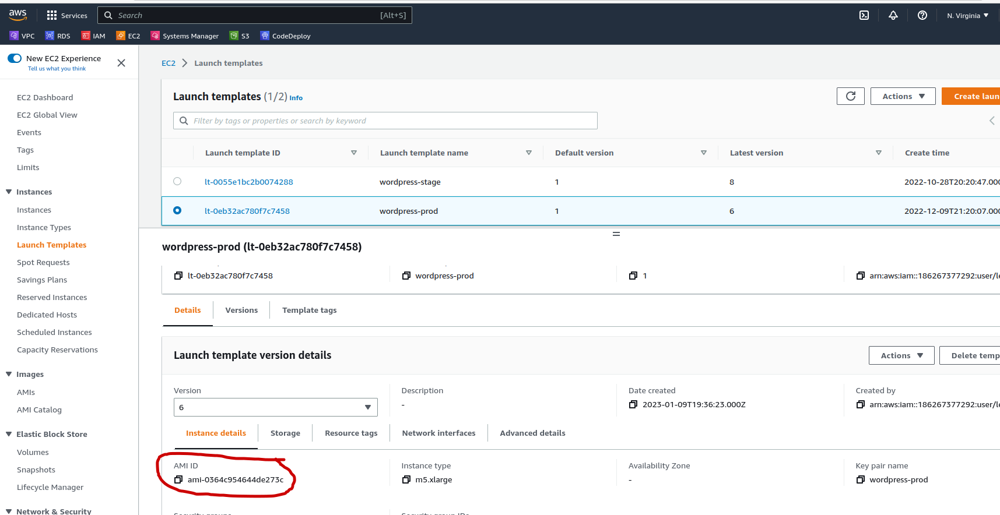

# Documentação da Infra AWS da Finance One #

## Infraestrutura como Código ##

Grande parte da infraestrutura está como código. Foi utilizado o terraform.  
Os arquivos terraform(.tf) de cada ambiente estão nas pastas [terraform/stage](/finance-one/terraform/stage) e [terraform/prod](/finance-one/terraform/prod)

Os terraform states estão salvos em um bucket s3, de acordo com o que está configurado nos arquivos [backend.tf de stage](/finance-one/terraform/stage/backend.tf) e [backend.tf de prod](/finance-one/terraform/prod/backend.tf)

O nome do profile utilizado é finance1. É um profile local criado com ```aws configure --profile finance1``` utilizando uma Access Key e Secret Key da conta AWS da FinanceOne

## Rede ##

Foi criado duas VPC, stage e prod, cada uma com 2 availability zones, privadas e públicas. No total de 4 subnets em cada VPC.  
Há NAT Gateway configurado nas redes públicas.  
Essas configurações estão nos arquivos [main.tf de stage](/finance-one/terraform/stage/main.tf) e [main.tf de prod](/finance-one/terraform/prod/main.tf), e os parametros referenciados no [terraform.tfvars de stage](/finance-one/terraform/stage/terraform.tfvars) e [terraform.tfvars de prod](/finance-one/terraform/prod/terraform.tfvars)

## Instâncias ##

* EC2  
    Criado as instâncias EC2 wordpress-stage e wordpress-prod através do terraform.  
    Estão nos arquivos [ec2.tf de stage](/finance-one/terraform/stage/ec2.tf) e [ec2.tf de prod](/finance-one/terraform/prod/ec2.tf)

* RDS  
    Criado as instâncias RDS f1clone e financeone-prod através do terraform.
    Estão nos arquivos [rds.tf de stage](/finance-one/terraform/stage/rds.tf) e [rds.tf de prod](/finance-one/terraform/prod/rds.tf)

## AutoScaling Groups ##

Autoscaling group e seus componentens nao estao no terraform.
Porem estamos usando imagens AMI que foram geradas com as EC2 que foram criadas atraves do terraform.
Para verificar quais sao as AMI, basta verificar os templates em Launch Templates:  


## Deployment ##

* O deployment do wordpress e feito nas instâncias EC2 utilizando o Auto Scaling Group através do Code Deploy com S3, e utilizando o Bitbucket Pipelines:  
    ```
    Bitbucket Pipelines > AWS Code Deploy > S3 Bucket > Auto Scaling Group > EC2  
    ```

## Certificados TLS ##

Estamos usando 3 certificados TLS para o https:  

* DNS + CDN (Cloudflare)
* Elastic Load Balancer (AWS)
* Instancias EC2 ( AWS + CertBot + LetsEncrypt)

Todos esses certificados renovam automaticamente, sem necessidade de alguem renovar manualmente.

Para algumas informacoes sobre o cert-bot:  
https://certbot.eff.org/instructions?ws=apache&os=centosrhel7
